# 🎪 CHAOS [ 404: Design Not Found ]

**CHAOS ( 404: Design Not Found )** is a beautifully broken tribute to everything *wrong* in web design. A digital circus where UI laws are shattered, UX logic is ignored, and every component behaves like it has a mind of its own. This project embraces the absurd, the glitchy, the misaligned, and the visually painful, turning them into an intentional aesthetic. It's not just a project… it's an experience. A satire-driven playground where every animation is unpredictable, every interaction is questionable, and every pixel challenges your sanity in the most entertaining way possible.

Crafted using **React**, **TypeScript**, and **TailwindCSS**, this chaotic experiment pushes the boundaries of bad design to reveal the hidden beauty in disorder. Whether you're here to laugh at UI disasters, study what *not* to do in real-world projects, or simply enjoy a harmless dose of front-end anarchy, this project stands as a comedic, educational, and oddly inspiring take on the world of web aesthetics gone rogue. Welcome to the art of intentional design failure where chaos isn’t a bug… it’s the main feature.


<br>

## 📚 Table of Contents

* [✨ Features](#-features)
* [🎨 Component Gallery](#-component-gallery)
* [📁 Project Structure](#-project-structure)
* [⚙️ Technologies Used](#-technologies-used)
* [🚀 Getting Started](#-getting-started)
* [🎪 Usage Guide](#-usage-guide)
* [⚠️ Warning](#-warning)
* [🌈 Customization Ideas](#-customization-ideas)
* [🛠️ Technical Details](#-technical-details)
* [🤝 Contributing](#-contributing)
* [📄 License](#-license)
* [📢 Author](#-author)
* [🎯 Project Philosophy](#-project-philosophy)
* [⭐ Support](#-support-the-chaos)

<br>

## ✨ Features

### 🚨 **Glitch & Chaos Components**

Includes Masterpieces Like:

* `BlueScreenOfChaos` – Intentionally Triggers Fake BSOD Moments
* `GlitchEffects` – Random Interference Animations
* `TextCorruption` – Destroys Typography With Style  <br><br>

### 💀 **Aesthetic Crimes**

* `DeathByAesthetic.tsx` – Visual Overload Of Gradients & Neon
* `TypographyCrime.tsx` – Fonts That Should Be Illegal <br><br>

### 🤡 **Broken UI Patterns**

* `BrokenNav` – Navigation That Hates Users
* `LayoutDisaster` – Layouts That Refuse To Align
* `UselessInteractions` – Buttons That Do Nothing Or Too Much <br><br>

### 🎮 **Interactive Chaos**

* `InteractiveHell` – Hover → Regret
* `BuggyMatrix` – Falling Characters, But Unstable
* `CursorEffect` – Your Cursor Is No Longer Yours


<br>

## 🎨 Component Gallery

| **Chaotic Hero**                                    | **Broken Footer**                                    |
| --------------------------------------------------- | ---------------------------------------------------- |
| 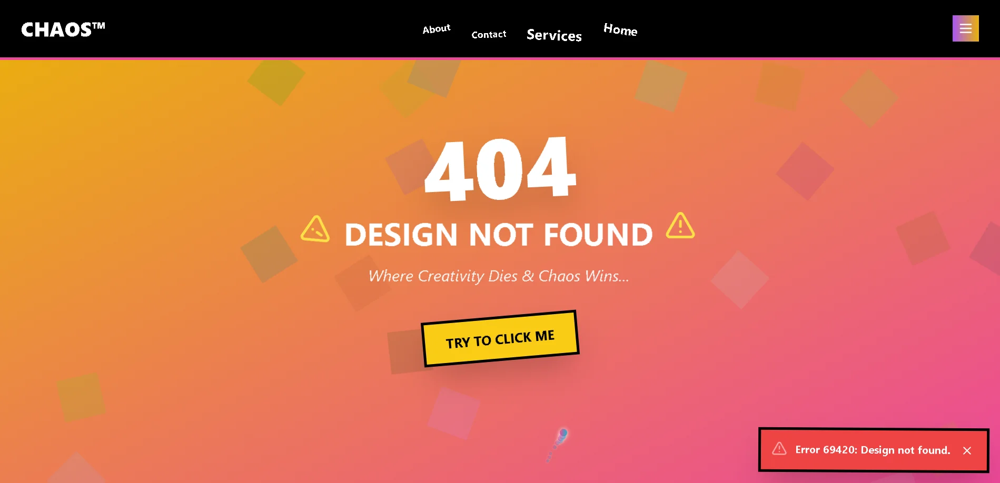 | 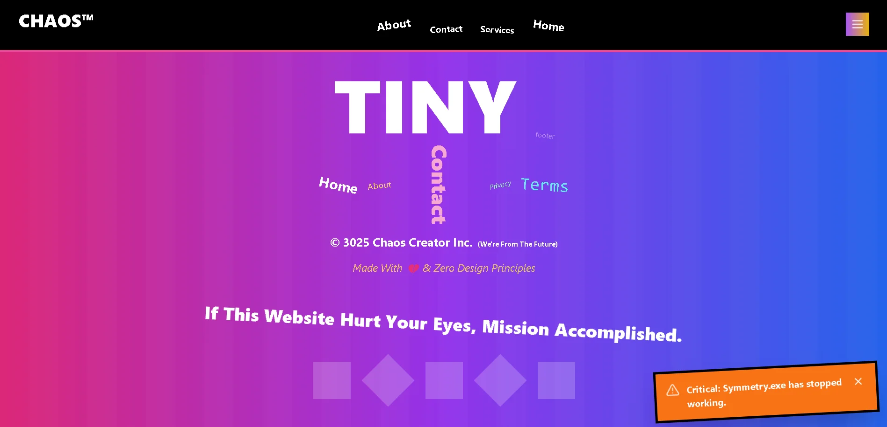 |

| **Typography Crime**                                    | **Layout Disaster**                                    |
| ------------------------------------------------------- | ------------------------------------------------------ |
| 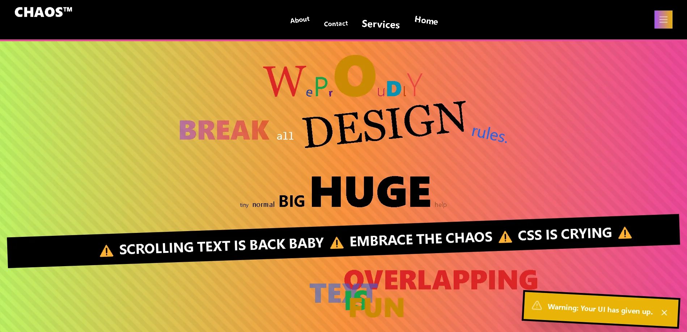 | 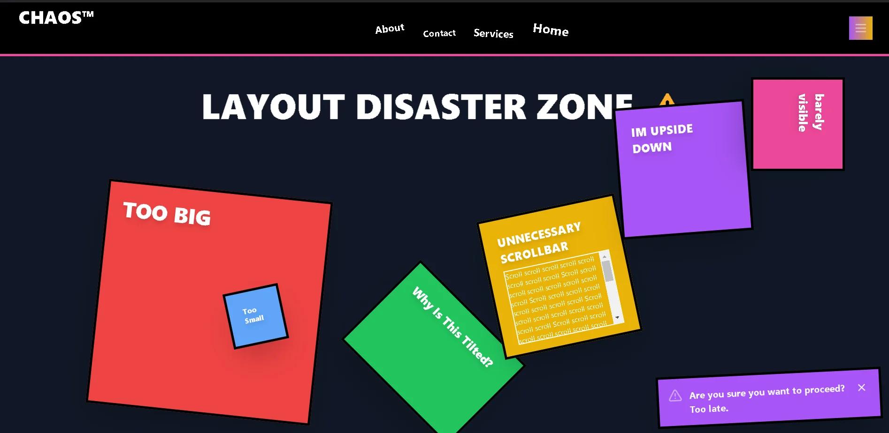 |

| **Useless Interactions**                                    | **Absolute Nonsense Zone**                               |
| ----------------------------------------------------------- | -------------------------------------------------------- |
| 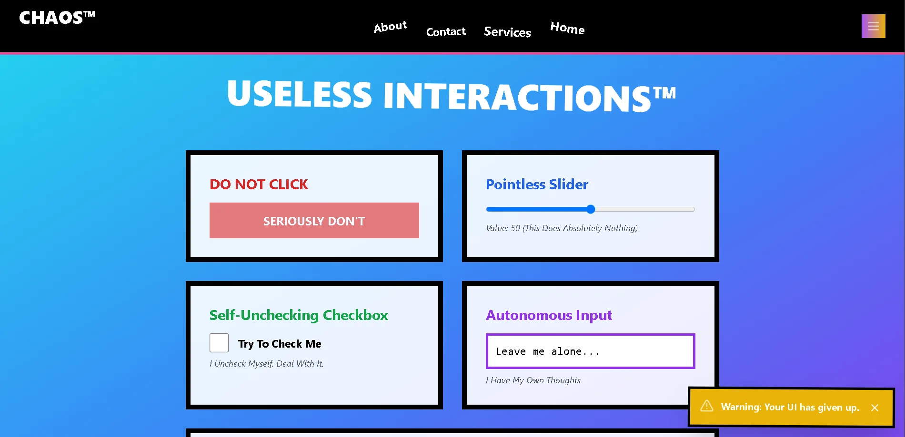 | 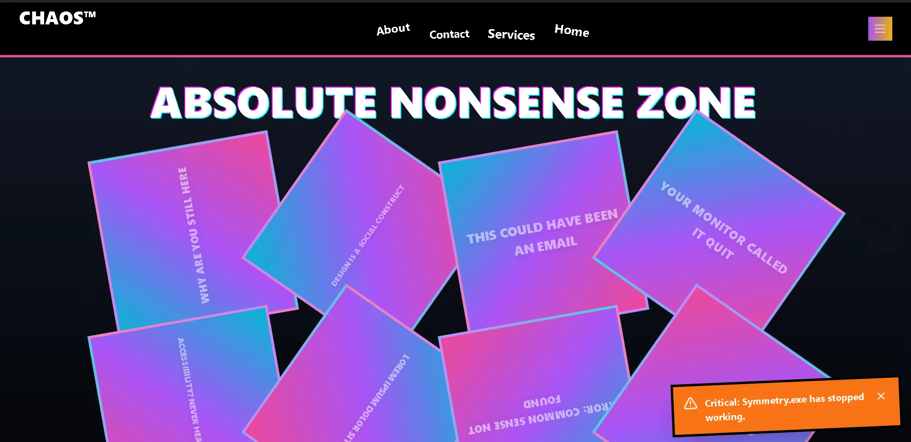 |

| **Error**                              | **Interactive Hell**                                    |
| --------------------------------------------------- | ------------------------------------------------------- |
| 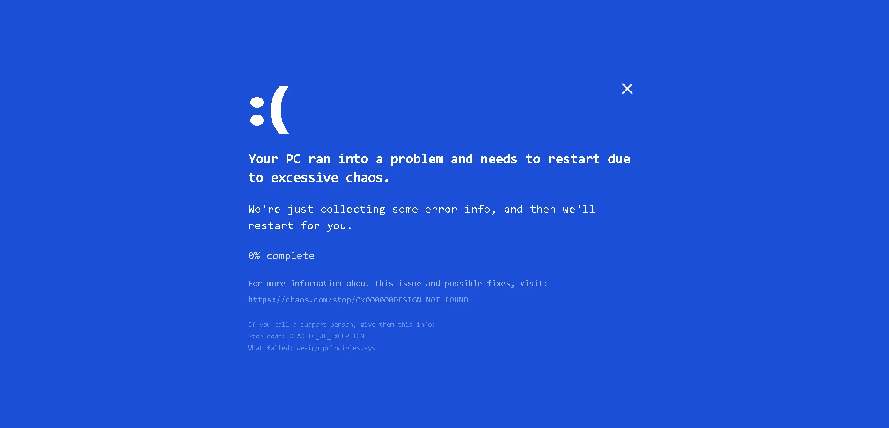 | 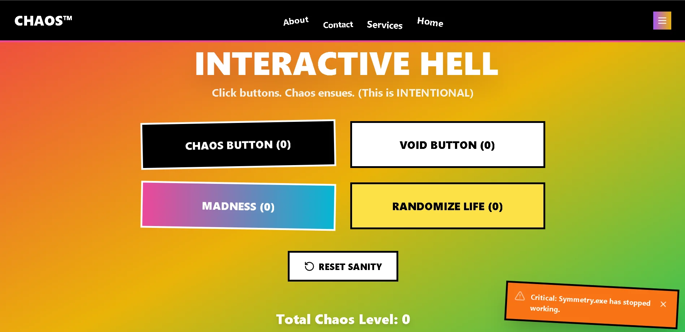 |

| **AI is Spiraling**                                 | **Death By Aesthetic**                                     |
| --------------------------------------------------- | ---------------------------------------------------------- |
| 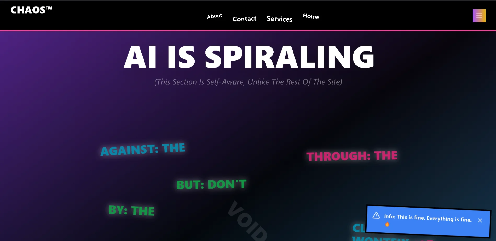 | 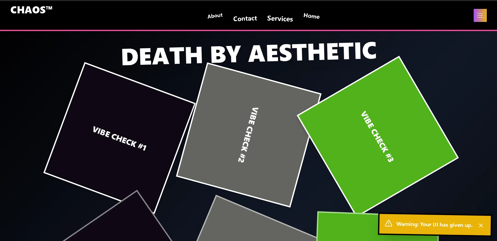 |

| **Buggy Matrix**                                     | **Feedback Form**                                     |
| ---------------------------------------------------- | ----------------------------------------------------- |
| 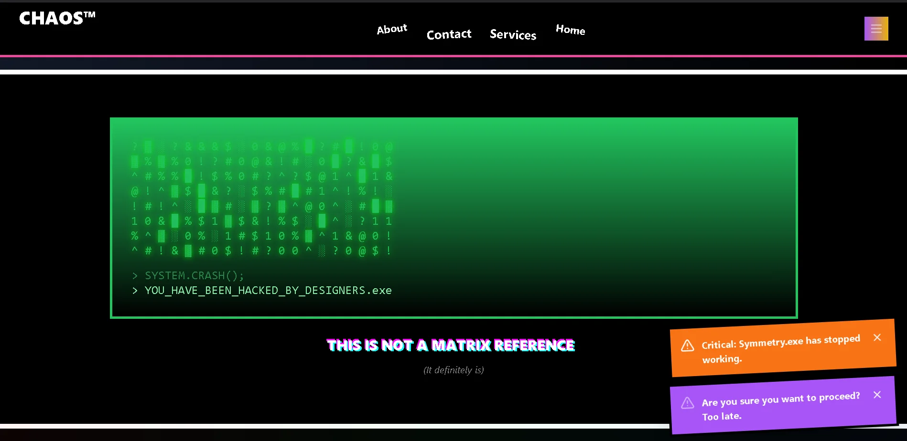 | 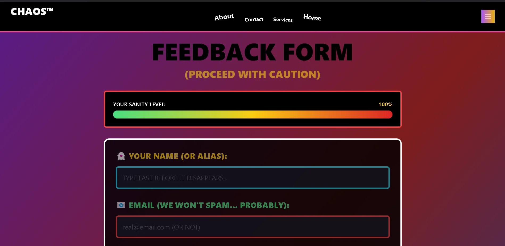 |


<br>

## 📁 Project Structure

```bash
Design_Not_Found/
├── 📁NotFound_
│   ├── 📁src
│   │     ├── 📁components
│   │     │    ├── AbsoluteNonsense.tsx          # Pure Chaotic Elements
│   │     │    ├── BlueScreenOfChaos.tsx         # Fake System Crashes
│   │     │    ├── BrokenFooter.tsx              # Non-Functional Footer
│   │     │    ├── BrokenNav.tsx                 # Confusing Navigation
│   │     │    ├── BuggyMatrix.tsx               # Animated Bug Patterns
│   │     │    ├── ChaosEngine.tsx               # Core Chaos Generator
│   │     │    ├── ChaoticHero.tsx               # Messy Hero Section
│   │     │    ├── CursorEffect.tsx              # Crazy Cursor Trails
│   │     │    ├── DeathByAesthetic.tsx          # Visual Overload
│   │     │    ├── ErrorPopups.tsx               # Annoying Popups
│   │     │    ├── FeedbackForm.tsx              # Worst Form Ever
│   │     │    ├── FracturedReality.tsx          # Broken Layouts
│   │     │    ├── GlitchEffects.tsx             # Visual Distortions
│   │     │    ├── InteractiveHell.tsx           # Frustrating UI
│   │     │    ├── LayoutDisaster.tsx            # Layout Chaos
│   │     │    ├── Spiraling.tsx                 # Spinning Madness
│   │     │    ├── TextCorruption.tsx            # Unreadable Text
│   │     │    ├── TypographyCrime.tsx           # Font Nightmares
│   │     │    └── UselessInteractions.tsx       # Pointless Features
│   │     │
│   │     ├── App.tsx                            # Main Application
│   │     ├── index.css                          # Global Styles
│   │     ├── main.tsx                           # Application Entry
│   │     └── vite-env.d.ts                      # TypeScript Definitions
│   │
│   ├── .env                                     # Environment Variables
│   ├── .gitignore                               # Git Ignore Rules
│   ├── eslint.config.js                         # ESLint Configuration
│   ├── index.html                               # HTML Template
│   ├── package-lock.json                        # Dependency Lock
│   ├── package.json                             # Project Dependencies
│   ├── postcss.config.js                        # PostCSS Configuration
│   ├── tailwind.config.js                       # TailwindCSS Config
│   ├── tsconfig.app.json                        # TypeScript App Config
│   ├── tsconfig.json                            # TypeScript Config
│   ├── tsconfig.node.json                       # TypeScript Node Config
│   └── vite.config.ts                           # Vite Configuration
│    
├── .gitattributes                               # Git Attributes
├── README.md                                    # Project Documentation
└── LICENSE                                      # MIT License
```

<br>

## ⚙️ Technologies Used

| Tech                   | Usage                                         |
| ---------------------- | --------------------------------------------- |
| **React (TypeScript)** | Component-Based Chaos With Type Safety        |
| **Vite**               | Fast Development & Building                   |
| **TailwindCSS**        | Utility-First CSS For Rapid Styling           |
| **Web3Forms**          | Chaotic Form Submissions                      |
| **CSS Animations**     | Keyframe Animations For Visual Madness        |
| **Context API**        | Global State Management For Chaos             |
| **ESLint**             | Keeps Code Clean (UI Remains Dirty)           |

<br>

## 🚀 Getting Started

To Experience The Chaos Locally:

1. **Clone The Repository**

```bash
git clone https://github.com/your-username/Design_Not_Found.git
cd Design_Not_Found/NotFound_
```

---

2. **Install Dependencies**

```bash
npm install
```

---

3. **Start The Chaotic Development Server**

```bash
npm run dev
```

---

4. Open `http://localhost:5173` In Your Browser & Prepare For Madness!

---

5. Build For Production

```bash
npm run build
```
---

```text
⚠️ Warning: This Project May Cause Temporary Confusion, Frustration & Unexpected Laughter!
```

<br>

## 🎪 Usage Guide

1. **🔄 Navigate Randomly** – Don't expect logical navigation flow
2. **🎯 Interact With Everything** – Buttons, forms, and elements behave unexpectedly
3. **📱 Test Responsiveness** – See how chaos looks on different screens
4. **😵 Experience Sensory Overload** – Multiple animations and effects running simultaneously
5. **📝 Try The Feedback Form** – The most frustrating form you'll ever encounter
6. **🎮 Play With Interactive Elements** – Nothing works as expected
7. **📊 Observe Layout Chaos** – Overlapping elements and broken grids

<br>

## ⚠️ Warning

This Project Contains:

- ⚡ Flashing animations and rapid color changes
- 🎵 Unexpected sounds and audio elements  
- 🖱️ Frustrating user interactions
- 📱 Intentionally broken responsive design
- 💀 Fake error messages and system crashes
- 🎪 Pure chaotic energy <br><br>

**Not Recommended For:** 
- People with photosensitive epilepsy
- Those easily frustrated by bad UX
- Anyone looking for a functional website
- Serious business applications

<br>

## 🌈 Customization Ideas

**Want To Add More Chaos? Try:**

* 🎵 Add random sound effects on interactions
* 🌈 Implement seizure-inducing color cycles
* 🖱️ Create more frustrating cursor behaviors
* 📱 Add fake loading screens and timeouts
* 🔄 Implement random page redirects
* 💬 Add confusing chatbot interactions
* 🎮 Create "games" that are impossible to win

<br>

## 🛠️ Technical Details 

### 🧪 **Component Overview**

| Component          | Description                                       |
| ------------------ | ------------------------------------------------- |
| `AbsoluteNonsense` | Does Something. Probably.                         |
| `ChaosEngine`      | Core Logic That Fuels The Madness.                |
| `ErrorPopups`      | Fake Error Spam.                                  |
| `FracturedReality` | Warps UI Elements Randomly.                       |
| `Spiraling`        | CSS Animations That Give Motion Sickness.         |
| `FeedbackForm`     | The Only Component That Behaves Normally (Maybe). |

<br>

### 📁 **Important Config Files**

| File                 | Purpose                          |
| -------------------- | -------------------------------- |
| `.env`               | Store Environment Variables      |
| `.gitignore`         | Ignore Build & Environment Files |
| `tailwind.config.js` | Tailwind Setup                   |
| `vite.config.ts`     | Vite Configuration               |
| `tsconfig.json`      | TypeScript Configuration         |

<br>

## 🤝 Contributing

We Welcome Contributions That Make This Project Even More Chaotic...

### How To Add More Chaos:

```bash
# 1. Fork The Repository 🍴
  git clone https://github.com/FrostByte-49/Design_Not_Found.git
  cd Design_Not_Found/NotFound_

# 2. Create Your Chaos Branch 🌪️
  git checkout -b feature/more-madness

# 3. Break Some Conventions 🎯
  - Add confusing animations
  - Implement frustrating interactions  
  - Create visual nightmares

# 4. Commit The Madness 💥
  git commit -m "💀 Added: More chaotic elements to break user expectations"
  git push origin feature/more-madness

# 5. Open a Pull Request 🔥
```

### Areas Needing More Chaos:

* 🔧 More broken animations and transitions
* 🌟 Additional frustrating user interactions  
* 🎨 Even worse color combinations
* 📖 More confusing text and copy
* 🖱️ Additional cursor nightmares
* 📱 More responsive design failures

<br>

Feel Free To Contribute Your Own Cursed Components. <br>
The Only Rule: `Make It Worse, But Beautifully.`

<br>

## 📄 License

This Project is licensed under the [MIT License](https://opensource.org/licenses/MIT). Feel free to explore and build upon it. <br>
**© 2025 Pranav Khalate**  

```text
Permission Is Hereby Granted, Free Of Charge, To Any Person Obtaining A Copy...
```

<br>

## 📢 Author

**Created By - Pranav Khalate**

[](https://github.com/your-username) &nbsp;
[](mailto:your-email@example.com) &nbsp;
[](https://your-portfolio.com) &nbsp;
[](https://www.linkedin.com/in/pranav-kh/) &nbsp;
[](https://discord.com/users/1377918872925241375)


<br>

## 🎯 Project Philosophy

> *"In a world of perfect design systems and consistent user experiences, sometimes you need to embrace the chaos. This project is a celebration of everything that can go wrong and a reminder that even in disorder, there can be beauty, humor, and valuable lessons about what not to do."*

<br>

## ⭐ Support The Chaos

If this project made you laugh, cry, or question your life choices, consider giving it a ⭐️ because even chaos deserves recognition!

<br>

> 💬 *Have ideas for more chaotic features? Found a bug that's actually a feature? Open an issue and join the madness!*